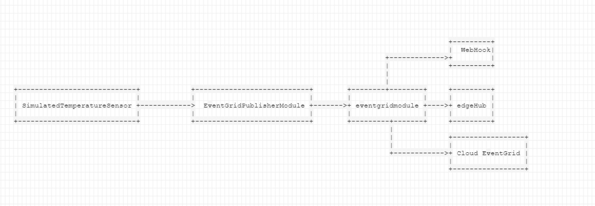

## Sample on how to use EventGrid on Edge

Message Flow:

                                                                                
- Replace \<YOUR_CONTAINER_REGISTRY_NAME\> in deployment.debug.template.json, deployment.template.json and all module.json files with the name of your registry
- Replace \<YOUR_CONTAINER_REGISTRY>\ in in deployment.debug.template.json and deployment.template.json with the login URL of your container registry
- Build and publish EventGridPublisherModule and EventGridSubscriberModule modules to a container registry
- Replace \<PUT YOUR SAS KEY HERE\> in deployment.debug.template.json and deployment.template.json with your SAS Key. You can generate one [here](https://generate.plus/en/base64?gp_base64_base%5Blength%5D=64)

- If you also want to forward messages from your local EventGrid module to your Cloud EventGrid set values for CLOUD_EVENTGRID_ENDPOINT and     CLOUD_EVENTGRID_SAS_KEY in the Env section of the EventGridSubscriberModule in deployment.debug.template.json and deployment.template.json

- Deploy: az iot edge deployment create --deployment-id [deployment id] --hub-name [hub name] --content [file path] --labels "[labels]" --target-condition "[target query]" --priority [int].  
**Example:** *az iot edge deployment create --deployment-id blobtestdeployment --hub-name vislepakhub --content config\deployment.amd64.json --target-condition "deviceId='vislepak-edge'" --priority 5*